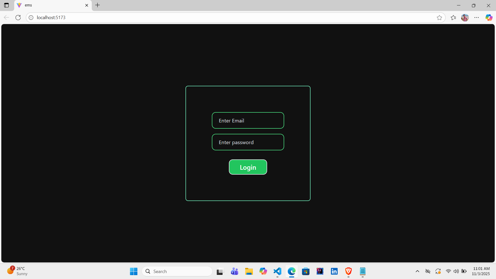
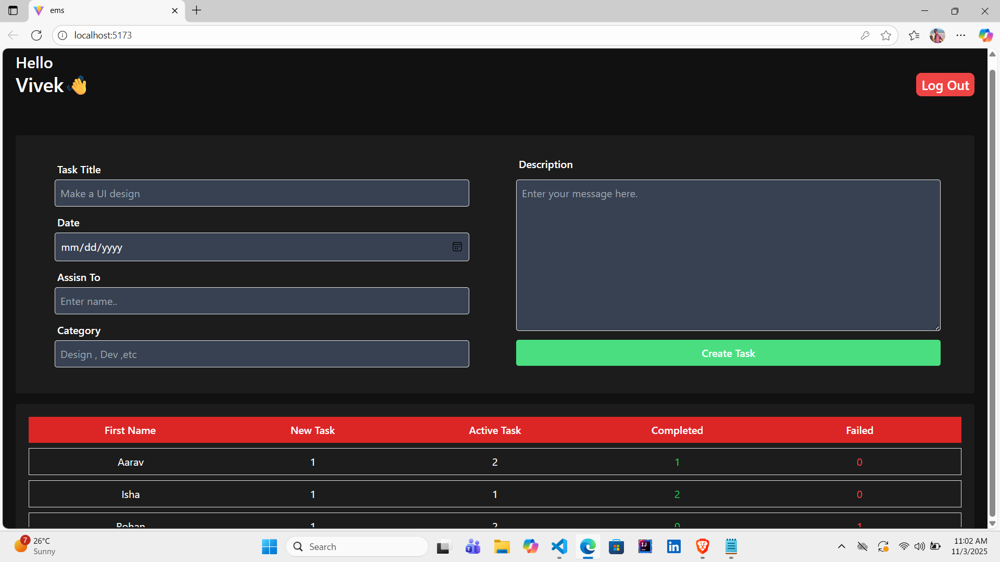
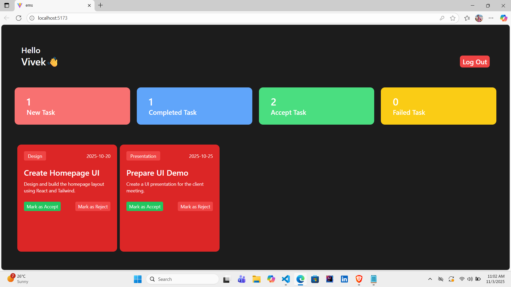

# 👨‍💻 Author

**Vivek Rana**  
📧 [vivekrana1301@gmail.com]  
🌐 [https://github.com/vivekrana](https://github.com/vivekrana1301-source)  
💼 [LinkedIn Profile](https://www.linkedin.com/in/vivek-rana-844679309) 


# 🧑‍💼 Employee Management System

A simple **Employee Management System** built using **React, Vite, and Tailwind CSS**, where employee data is stored in **localStorage** (no backend).  

This project demonstrates CRUD operations (Create, Read, Update, Delete) and serves as a small-scale admin dashboard for managing employees efficiently.

---

## 🚀 Features

- 🔐 Login page with simple authentication  
- ➕ Add new employee details  
- ✏️ Edit employee information  
- ❌ Delete employees  
- 💾 Data stored locally using browser **localStorage**  
- ⚡ Built with **React + Vite** for fast development  
- 🎨 Styled using **Tailwind CSS**

---

## 🛠️ Tech Stack

| Technology | Purpose |
|-------------|----------|
| React | Frontend framework |
| Vite | Development + Build tool |
| Tailwind CSS | Styling |
| LocalStorage | Data persistence |

---

## 📸 Screenshots

### 🔐 Login Page


### 🏠 Admin Page


### ➕ Employee Page



---

## ⚙️ Installation and Setup

1. Clone this repository:
   ```bash
   git clone https://github.com/<your-username>/employee-management-system.git
